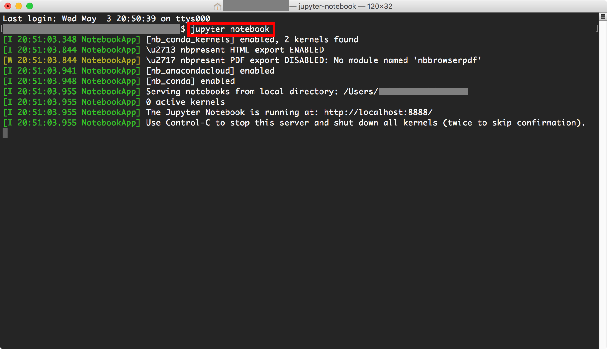
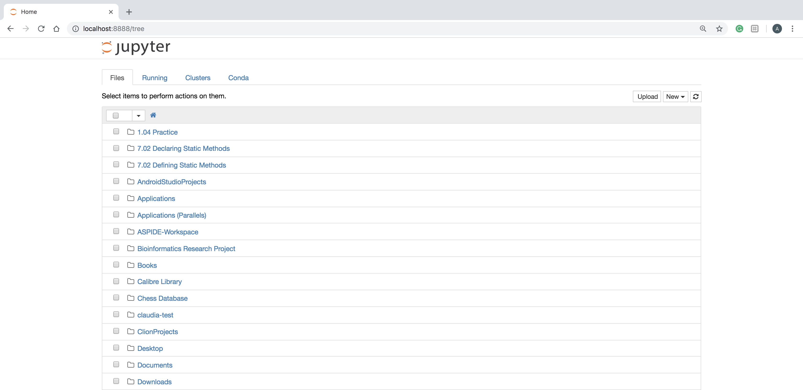

# IntroToDeepLearning

This is the GitHub repo for the 2018 AIS Intro to Deep Learning Workshop.

Please install the following software dependencies:

- **Anaconda** - distribution of Python with many useful ML and data science libraries.
- **TensorFlow** - popular deep learning library created by the Google Brain Team.
- **Keras** - a high-level deep learning library that runs on top of TensorFlow.

To install Anaconda please visit: https://www.anaconda.com/download/

After installing Anaconda, open your Terminal (on MacOS or Linux) or the Anaconda Prompt (on Windows)
and run the following commands to install **TensorFlow** and **Keras**:

- **TensorFlow**: **conda install tensorflow**
- **Keras**: **conda install keras**

## Tutorials on Installing These Libraries

Video: https://www.youtube.com/watch?v=PG4gCxIelrs

Article: https://machinelearningmastery.com/setup-python-environment-machine-learning-deep-learning-anaconda/

## Contents of this Repository
- **images** - a directory with all of the graphics used as examples for the Jupyter notebook
- **Intro to Deep Learning Slides.pdf** - the Google Slides presentation for this workshop in PDF format.
- **Intro to Deep Learning.ipynb** - a Jupyter notebook with all of the code, explanations, and examples for the workshop.
- **Intro to Deep Learning Full Output.ipynb** - a Jupyter notebook with the full expected output of running the code. (follow this if you are having installation problems or other errors running the code in the original notebook)
- **README.md** - the document you are reading right now, which contains helpful information about this repo.

## Getting Started with Jupyter
Once you've installed all of the libraries, you can download or clone this GitHub repo and launch Jupyter
by opening up your terminal or Anaconda Prompt and typing the command **jupyter notebook**. You can also
go to your Anaconda navigator and launch Jupyter from there.

After starting Jupyter you should see your filesystem displayed in a screen that looks like this:

